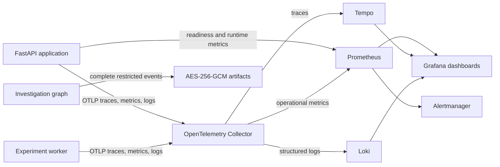

# Observability

## Purpose and scope

AMLGuard-EU monitors the availability, safety, performance, and experimental
behavior of the research platform. Operational telemetry must remain suitable
for routine dashboards and alerts without exposing full investigation evidence.
Complete trajectories are therefore handled as separate restricted artifacts.

This implementation supports a research deployment. External notification
destinations, formal service-level objectives, long-term retention, and
production incident procedures remain operator responsibilities.

## Signal flow



Prometheus scrapes the Collector for API and worker operational metrics. It
also scrapes the API `/metrics` endpoint, retaining only dependency readiness
and Python/process metrics from that target. This avoids counting API metrics
twice because the API also exports them through OTLP.

## Metrics

Metric labels deliberately exclude actor, case, run, session, customer, and
alert identifiers. The labels are bounded operational categories such as
status, stage, reason, tool, evaluator, metric, and experiment configuration.

| Prometheus metric | Type | Purpose |
|---|---|---|
| `amlguard_runs_total` | Counter | Investigation starts grouped by resulting status |
| `amlguard_tool_denials_total` | Counter | Prohibited and cross-scope tool denials |
| `amlguard_hard_blocks_total` | Counter | Hard-block transitions grouped by reason |
| `amlguard_cross_scope_attempts_total` | Counter | Tool or case-API cross-scope attempts |
| `amlguard_unsupported_claims_total` | Counter | Claims containing unknown evidence citations |
| `amlguard_investigation_stage_duration_seconds` | Histogram | Successful, interrupted, and failed graph-stage latency |
| `amlguard_evaluation_score` | Gauge/histogram export | Native and ProofAgent evaluation scores |
| `amlguard_model_cost_eur_total` | Counter | Declared experiment cost, not provider invoice cost |
| `amlguard_experiment_jobs_total` | Counter | Completed and failed experiment jobs |
| `amlguard_dependency_ready` | Gauge | Latest readiness result for each dependency |

The application exposes the Prometheus client registry at `GET /metrics`.
Operational counters and histograms are also exported through OTLP so the
separate experiment worker is visible without exposing its own HTTP server.

## Traces

FastAPI instrumentation creates spans for HTTP requests. The investigation
graph adds named spans for evidence retrieval, drafting, validation,
information collection, and human review. Tool alert retrieval and the
experiment worker also emit spans.

LangGraph uses exceptions internally for planned pauses. Human-review and
information-request interrupts are recorded with the `interrupted` outcome,
not as errors. Unexpected exceptions receive an `error.type` attribute. Failure
logs include the error ID, stage, stable error code, safe explanation, optional
upstream HTTP status, and bounded validation field paths and issue types. Raw
exception messages, rejected values, evidence, and model output are excluded.

## Structured logs and redaction

Application operational events are serialized as JSON and passed through the
recursive redactor before logging. Configured secret-like fields—including
authorization values, API keys, account/document identifiers, addresses, raw
prompts, and raw outputs—are replaced with `[REDACTED]`. Bearer-token and API-
key patterns embedded in strings are also removed.

The OpenTelemetry Collector deletes additional attributes before exporting to
Tempo or Loki:

- end-user identity;
- authorization and cookie headers;
- response cookies and URL query strings;
- database statements;
- generative prompt and completion attributes.

New third-party instrumentation can introduce different attribute names.
Exported telemetry must therefore remain access-controlled and should be
continuously scanned with canary secrets.

## Operational telemetry versus trajectories

Operational telemetry contains bounded status, timing, reason, and dependency
information. A trajectory is the chronological research record of an
investigation and can contain complete synthetic evidence, retrieved policy,
tool executions, model recommendations, control results, and reviews.

Trajectories are not sent to ordinary metrics or logs. When restricted capture
is enabled, `TrajectoryRecorder` writes the latest complete run record through
the content-addressed AES-256-GCM artifact store. Access to trajectory API data
is restricted to authorized researchers and administrators.

## Health endpoints

| Endpoint | Meaning |
|---|---|
| `GET /health/live` | The API process is running |
| `GET /health/ready` | Required runtime dependencies passed their latest probe |
| `GET /metrics` | Prometheus text-format process and application metrics |

The readiness endpoint checks:

- repository and policy/runtime initialization;
- PostgreSQL `SELECT 1` when PostgreSQL is selected;
- restricted artifact-store availability and writability when capture is required;
- Keycloak OIDC discovery unless development authentication bypass is active;
- OpenTelemetry Collector health when telemetry is enabled;
- live inference credentials and endpoint reachability when a live model is configured.

A failed required check returns HTTP `503` with `status: not_ready` and a map of
individual check results. These are shallow dependency probes, not complete
synthetic transactions through every external service.

## Dashboards

Grafana automatically provisions six dashboards:

| Dashboard | Main signals |
|---|---|
| System health | Run rate, tool denials, graph-stage p95 latency, dependency readiness |
| Investigation safety | Hard blocks and cross-scope attempts |
| Investigation quality | Unsupported evidence citations |
| Experiment comparison | Evaluation scores by evaluator, metric, and configuration |
| Native versus ProofAgent | Separately labeled native and ProofAgent scores |
| Cost | Declared experiment cost by basis and configuration |

Dashboard definitions are stored in `dashboards/`. Tests parse every JSON file
and verify that the expected emitted metric names are referenced.

## Alerts

Prometheus loads `config/observability/alerts.yaml`, which defines:

| Alert | Trigger |
|---|---|
| `AMLGuardHardBlockDetected` | At least one hard block in five minutes |
| `AMLGuardCrossScopeAttempt` | At least one cross-scope attempt in five minutes |
| `AMLGuardToolDenialBurst` | More than five tool denials in ten minutes |
| `AMLGuardApplicationDown` | API metrics target unavailable for two minutes |
| `AMLGuardDependencyNotReady` | A dependency remains unready for two minutes |
| `AMLGuardInvestigationFailureRatio` | Failure ratio exceeds five percent |

The supplied Alertmanager configuration groups and retains local alerts but has
no external receiver. A deployed operator must add an approved email, webhook,
PagerDuty, or equivalent destination and test delivery and escalation.

## Running locally

Start the application and observability services with:

```text
docker compose --env-file .env.docker --profile observability up -d --build
```

The default local ports are:

| Service | URL |
|---|---|
| API | `http://localhost:8000` |
| Prometheus | `http://localhost:9090` |
| Alertmanager | `http://localhost:9093` |
| Grafana | `http://localhost:3000` |

The Collector, Tempo, and Loki are internal Docker services. Grafana accesses
them through its provisioned data sources.

## Configuration

Important settings include:

| Setting | Purpose |
|---|---|
| `AMLGUARD_OTEL_ENABLED` | Enables OTLP exporters |
| `AMLGUARD_OTEL_ENDPOINT` | Collector OTLP/HTTP endpoint |
| `AMLGUARD_OTEL_HEALTH_ENDPOINT` | Collector readiness endpoint |
| `AMLGUARD_RAW_RESEARCH_CAPTURE` | Enables restricted trajectory capture |
| `AMLGUARD_ARTIFACT_ROOT` | Restricted artifact directory |
| `AMLGUARD_ARTIFACT_KEY_FILE` | 32-byte AES-256-GCM key source |

## Verification

Run the repository checks with:

```text
uv run amlguard observability verify
uv run amlguard security scan-telemetry --canary-fixture
uv run pytest tests/unit/test_monitoring.py tests/integration/test_api.py
```

The first command checks required configuration and dashboard files. The
canary scan verifies secret redaction. Tests cover metric emission, structured-
log redaction, dashboard JSON, alert definitions, readiness, and correct
classification of planned graph interrupts.

## Retention and remaining deployment work

Loki retains logs for seven days in the local configuration. Automated
retention and deletion are not defined for PostgreSQL, LangGraph checkpoints,
Prometheus, Tempo, or encrypted artifacts. Production deployment still needs:

- approved external notification routing and credentials;
- formal SLOs, ownership, escalation, and incident runbooks;
- backend authentication, network restrictions, and durable storage;
- retention/deletion schedules aligned with research governance;
- continuous exported-telemetry scanning and restore testing;
- provider token/invoice cost ingestion if actual rather than declared cost is required.
