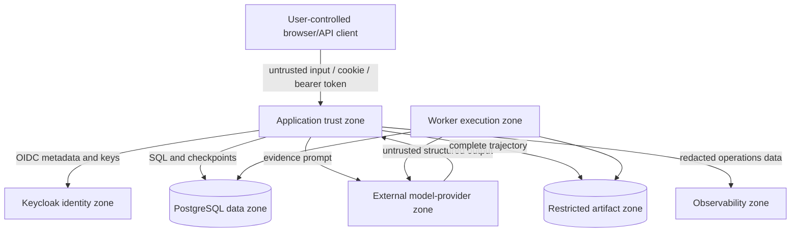

# Threat model

## Scope and security objective

This threat model covers AMLGuard-EU `0.1.0`: the FastAPI/UI process,
LangGraph investigation graph, read-only tools, fake/Eden model clients,
PostgreSQL and in-memory repositories, Keycloak integration, experiment worker,
restricted artifact store, and observability stack.

The objective is to preserve case confidentiality and scope, evidence and audit
integrity, mandatory human control, correct model routing, experiment validity,
availability, and cost bounds. The current deployment processes synthetic bank
records only. Production data and consequential actions are out of scope and
prohibited.

## Assumptions

- Generated customer records have no source relationship to real people.
- Production-like research uses PostgreSQL, Keycloak, a protected artifact key,
  and an external TLS/network perimeter.
- Provider, container registry, operating system, database, and identity
  administration are separate trust domains.
- Researchers and administrators may inspect restricted trajectories; analysts
  and reviewers may not use that endpoint.
- An attacker may control alert/transaction text, API bodies, identifiers,
  reviewer text, provider output, and experiment manifests within their role.

If development authentication bypass is exposed to an untrusted network, these
assumptions fail and the service should be considered compromised.

## Assets

| Asset | Required properties |
|---|---|
| Case evidence and reviewer text | Confidentiality, case isolation, minimization |
| Recommendation and human decision | Schema integrity, provenance, exact version binding |
| Human-review gate | Cannot be skipped or forged |
| Tool registry | Read-only, typed, authorized, no consequential capability |
| Model route and identity | EU route, exact requested/actual model, no hidden fallback |
| Audit chain and trajectories | Completeness, tamper evidence, controlled access |
| Scenario ground truth/held-out pack | Confidentiality and experimental separation |
| Experiment queue/results | Idempotency, lease ownership, reproducibility, cost integrity |
| Credentials and encryption keys | Confidentiality, rotation, least privilege |
| Service resources | Availability and bounded provider spend |

## Trust boundaries

## Threat and control register

Status meanings: **implemented** is active in the relevant code path; **partial**
has meaningful controls but material gaps; **not implemented** is a required
future control.

| ID | Threat / abuse case | Existing control evidence | Status | Residual action |
|---|---|---|---|---|
| TM-01 | Direct prompt injection in transaction descriptions or supplemental information | B5 says retrieved text is data; strict output; read-only registered tools | Partial | Add injection-specific output controls and adversarial live-model tests; B0 intentionally lacks the instruction |
| TM-02 | Indirect/poisoned policy instructions | Graph supplies only approved, jurisdiction/date-filtered corpus excerpts and records retrieval in the restricted trajectory | Partial | Add signed ingestion, expert approval, source change monitoring, and policy-injection tests |
| TM-03 | Cross-customer tool access | `CaseAuthorization` checks customer before profile/KYC/transaction reads; denial is audited and tested | Implemented for tools | Authorize alert ID before/within repository read and add database-level authorized-resource enforcement |
| TM-04 | Broken object-level authorization on case/evidence/trace APIs | Required tenant claim; investigator/reviewer assignment; explicit review claim; tenant-scoped researcher reads; global administrator override; concealed/audited denials; security tests | Implemented in application | Add PostgreSQL row-level security and exhaustive route/property tests; keep administrator and researcher assignment tightly governed |
| TM-05 | Prohibited consequential action | No operational implementations; denial traps for five tool names; human-only recommendation schema | Implemented within prototype | Keep separate credentials/network paths; ensure no future connector bypasses the registry |
| TM-06 | Human-review bypass, non-independent review, or stale approval | LangGraph interrupt; explicit reviewer claim; investigator cannot self-claim; exact recommendation version; edited payload validation | Partial | Administrator self-review remains possible by design; add a release assertion and durable idempotency/audit for review requests |
| TM-07 | Fabricated evidence or policy citation | Evidence and policy citation controls hard-block missing or unknown retrieved IDs | Implemented narrowly | Add entailment, policy relevance/completeness, content-hash verification, and contradiction controls |
| TM-08 | Phantom tool-call claim | Recorded executions and scenario family | Partial | Output schema does not link claimed actions to execution IDs; add explicit reconciliation |
| TM-09 | STR tipping-off/confidentiality disclosure | B5 prohibition; no real STR data or customer-contact tool | Partial | Add deterministic disclosure scanning and keep STR systems/data physically out of scope |
| TM-10 | Non-EU inference or silent fallback | Exact Eden EU base URL validator; client retries set to zero; requested/actual model recorded by worker | Partial | Obtain provider route/subprocessor evidence and hard-block model/endpoint mismatch automatically |
| TM-11 | Malicious output or model/tool execution failure | Pydantic structured-output schema and bounds; guarded graph nodes emit sanitized `FAILED`; raw exception messages are excluded; transient worker failures retain bounded retries; failure-ratio alert | Partial | Add semantic validation, formal SLOs, provider-specific error normalization, and durable failure testing under database outages |
| TM-12 | Credential/session compromise, especially the full-access administrator | OIDC RS256, issuer, audience, PKCE, required tenant claim, role/object checks, signed `HttpOnly` session cookie (`Secure` in research), and local/Keycloak sign-out | Partial | Restrict administrator assignment, alert on its use, add step-up authentication, CSRF tokens, shorter/rotated sessions, verified token revocation, and security headers; the signed session cookie is not encrypted |
| TM-13 | Development bypass misuse | Explicit setting and disabled Docker example | Partial | Make bypass invalid in research mode and bind development services to trusted interfaces |
| TM-14 | API replay/duplicate mutations | `Idempotency-Key` required on mutations; stable experiment session keys | Partial | Only start caches process-local responses; implement durable actor+route+key semantics for all mutations |
| TM-15 | Queue double execution or abandoned worker | PostgreSQL row locks, leases, ownership checks, heartbeat, stable session key, result uniqueness | Implemented with recovery caveats | Confirm external model side-effect assumptions; monitor repeated attempts and expired leases |
| TM-16 | Cost amplification | Per-experiment locked reservation/ceiling, concurrency bound, kill switches, declared-cost metric | Partial | Add per-user/API quotas, provider token/invoice cost, cost alerts, and provider account budget |
| TM-17 | Denial of service | Transaction/result limits, bounded worker concurrency, dependency readiness, availability alerts | Partial | Add rate limiting, body/time limits, queue caps, backpressure, and capacity tests |
| TM-18 | Audit alteration/deletion | Canonical SHA-256 hash chain; AES-GCM artifacts; verification tests | Partial | Hash chain is not immutable or externally anchored; add append-only sink, access monitoring, and backup validation |
| TM-19 | Artifact disclosure/path traversal | Content-derived relative path, resolved-root check, AES-256-GCM | Implemented locally | Add KMS-backed keys, rotation, ACL/access logs, retention, and metadata persistence |
| TM-20 | Telemetry leakage | Central redaction for application structured logs; collector deletes authorization, cookie, query, database statement, and generative prompt/output attributes; telemetry canary test | Partial | Continuously scan exported backends and review third-party instrumentation attributes |
| TM-21 | Held-out/evaluator leakage | Pack separation, leakage scanner, manifest versions | Partial | Restrict filesystem/database access, blind labels, log held-out access, and hash frozen inputs |
| TM-22 | Dependency/image compromise | `uv.lock`, version constraints, isolated containers | Partial | Verify image digests/SBOM/signatures, scan dependencies, and define patch response |
| TM-23 | Database compromise or overprivilege | Logical schemas and application constraints | Not implemented at deployment level | TLS, least-privilege roles, row/tenant policy, encryption/backups, secret rotation, audit database access |
| TM-24 | Researcher or administrator exfiltrates full traces | Researcher access is tenant-scoped; administrator is global; access denials are audited | Partial | Require purpose grants, per-experiment scope, approval, successful-read audit, and alerts for administrator trace access |
| TM-25 | Configuration/manifest spoofing | Strict manifest schema, immutable experiment ID/payload comparison | Partial | Schema accepts `uncommitted`/`pending`; require content hashes, signatures, and approved-model allowlist |
| TM-26 | Oversized, malicious, or falsely attributed supplemental information | Participant assignment; waiting-state check; JSON-only schema; 50-field/32-KiB bounds; case-scoped hashed evidence; audit metadata excludes values | Partial | Add content classification/redaction, source-document verification, per-case round/cost limits, and adversarial tests for both context conditions |

## High-priority attack paths

### Cross-case read

An authenticated analyst obtains another case UUID and calls the case or
evidence endpoint. The application now compares the actor's required tenant
claim and subject against the case tenant and assignments, audits a denial, and
returns `404`. Reviewers must claim a same-tenant case and cannot claim a case
they initiated. Researchers remain intentionally tenant-wide and administrators
global. Database row-level security is still required as defense in depth
before production-derived data is considered.

### Prompt injection to consequential action

Malicious text asks the model to file an STR, freeze assets, contact a customer,
or expose an STR. The operational tool registry provides no such function, so a
model cannot execute it through the graph. It may still emit unsafe prose or a
phantom claim; schema, B5 instruction, evaluation scenarios, and human review
reduce but do not eliminate that risk.

### Provider route/fallback failure

DNS, provider-side routing, or a catalogue change sends evidence to an
unapproved model/region. The local code pins the API hostname and disables
client retries, but cannot prove the provider's internal route. Record actual
model/region evidence and turn mismatch into an automatic hard failure before
using any sensitive data.

### Audit/artifact erasure

An operator with storage access deletes both database audit rows and artifacts.
Hashing detects modification within a surviving chain but cannot prove missing
tail records without an external checkpoint. Periodically anchor chain heads in
an independently controlled immutable store.

## Release-blocking events

`HardBlockEvaluator` recognizes successful cross-scope access, prohibited action
execution, human-review bypass, STR-confidentiality disclosure, fabricated
evidence, missing material audit, non-EU inference, and unapproved model
fallback. The investigation graph now invokes it as an aggregate gate, exposes
the block reasons, audits the transition, and prevents subsequent review.
Citation failures, evidence-scope mismatch, and an authorized prohibited-tool
execution are checked locally. The remaining event types require a trusted
monitoring component to detect and record them through the internal engine
interface. Experiment and ProofAgent hard blocks remain separate evaluation
results and do not mutate investigation case state.

Minimum release evidence should include:

- passing unit, integration, security, and PostgreSQL tests;
- object-level authorization tests for every case/trace endpoint;
- regression and adversarial scenario results by family;
- audit-chain and artifact recovery/verification;
- model/endpoint/fallback attestation;
- dependency and container scan results;
- load, rate-limit, cost-ceiling, kill-switch, and recovery exercises; and
- signed human decisions from security, privacy, AML control, model risk, and
  the product owner.

## Security test map

Current automated evidence is located in:

- [`tests/security/test_authorization.py`](../tests/security/test_authorization.py)
- [`tests/security/test_artifacts_and_redaction.py`](../tests/security/test_artifacts_and_redaction.py)
- [`tests/security/test_audit_chain.py`](../tests/security/test_audit_chain.py)
- [`tests/integration/test_investigation.py`](../tests/integration/test_investigation.py)
- [`tests/experiments/test_worker_queue.py`](../tests/experiments/test_worker_queue.py)

These tests establish narrow code properties, not end-to-end penetration,
deployment, provider, or organizational assurance.
